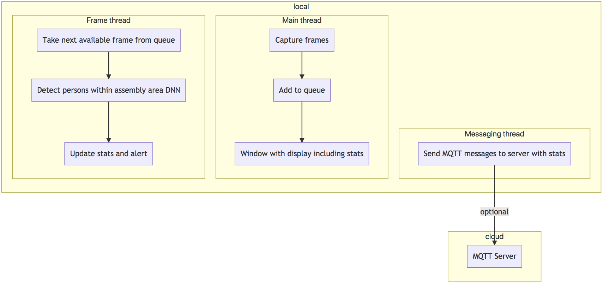

# Restricted Zone Notifier

| Details            |              |
|-----------------------|---------------|
| Target OS:            |  Ubuntu\* 16.04 LTS   |
| Programming Language: |  C++\* |
| Time to Complete:    |  45 min     |


## Introduction

This restricted zone notifier application is one of a series of reference implementations for Computer Vision (CV) using the OpenVINO™ toolkit. This application is designed for a machine mounted camera system that monitors if there are any humans present in a predefined selected assembly line area. It sends an alert if there is at least one person detected in the marked assembly area. The user can select the area coordinates either via command line parameters or once the application has been started they can select the region of interest (ROI) by pressing `ESC` key; this will pause the application, pop up a separate window on which the user can drag the mouse from the upper left ROI corner to whatever the size they require the are to cover. By default the whole frame is selected.

This example is intended to demonstrate how to use CV to improve assembly line safety for human operators and factory workers.

## Requirements

### Hardware
* 6th Generation Intel® Core™ processor with Intel® Iris® Pro graphics and Intel® HD Graphics

### Software
* [Ubuntu\* 16.04 LTS](http://releases.ubuntu.com/16.04/)
*Note*: You must be running kernel version 4.7+ to use this software. We recommend using a 4.14+ kernel to use this software. Run the following command to determine your kernel version:
```
uname -a
```
* OpenCL™ Runtime Package
* OpenVINO™ toolkit

## Setup

### Install OpenVINO™ Toolkit
Refer to https://software.intel.com/en-us/articles/OpenVINO-Install-Linux for more information about how to install and setup the OpenVINO™ toolkit.

You will need the OpenCL™ Runtime package if you plan to run inference on the GPU as shown by the
instructions below. It is not mandatory for CPU inference.

## How it works

The application uses a video source, such as a camera, to grab frames, and then uses a Deep Neural Network (DNNs) to process the data. The network detects persons in the frame, and then if successful it checks if the detected persons are in the indicated off-limits assembly line region.

The data can then optionally be sent to a MQTT machine to machine messaging server, as part of a industrial data analytics system.

The DNN model used in this application is an Intel® optimized models that is part of the OpenVINO™ toolkit.

You can find it here:

- `/opt/intel/computer_vision_sdk/deployment_tools/intel_models/pedestrian-detection-adas-0002`



The program creates three threads for concurrency:

- main thread that performs the video i/o
- worker thread that processes video frames using the deep neural networks
- worker thread that publishes any MQTT messages

## Setting the build environment

You must configure the environment to use the OpenVINO™ toolkit one time per session by running the following command:
```
    source /opt/intel/computer_vision_sdk/bin/setupvars.sh
```

## Building the code

Start by changing the current directory to wherever you have git cloned the application code. For example:
```
    cd restricted-zone-notifier-cpp
```

If you do not yet have a `build` directory create one:
```
    mkdir build
```

Then change to that directory:
```
    cd build
```

Now run the following commands:
```
    cmake ..
    make
```

Once the commands are finished, you should have built the `monitor` application executable.

## Running the code

To see a list of the various options:
```
    ./monitor -help
```

To run the application with the needed model using the webcam:
```
    ./monitor -m=/opt/intel/computer_vision_sdk/deployment_tools/intel_models/pedestrian-detection-adas-0002/FP32/pedestrian-detection-adas-0002.bin -c=/opt/intel/computer_vision_sdk/deployment_tools/intel_models/pedestrian-detection-adas-0002/FP32/pedestrian-detection-adas-0002.xml
```

You can select an area to be used as the "off-limits" area by pressing the `c` key once the program is running. A new window will open showing a still image from the video capture device. Drag the mouse from left top corner to cover an area on the plane and once done (a blue recatngle is drawn) present `ENTER` or `SPACE` to proceed with monitoring.

Once you have selected the "off-limits" area the coordinates will be displayed in the terminal window. You can run the application using those coordinates by using the `-x`, `-y`, `-h`, and `-w` flags to preselect that area.

### Hardware acceleration

This application can take advantage of the hardware acceleration in the OpenVINO toolkit by using the `-b` and `-t` parameters.

For example, to use the OpenVINO™ toolkit backend with the GPU in 32-bit mode:
```
    ./monitor -m=/opt/intel/computer_vision_sdk/deployment_tools/intel_models/pedestrian-detection-adas-0002/FP32/pedestrian-detection-adas-0002.bin -c=/opt/intel/computer_vision_sdk/deployment_tools/intel_models/pedestrian-detection-adas-0002/FP32/pedestrian-detection-adas-0002.xml -b=2 -t=1
```

To run the code using 16-bit floats, you have to both set the `-t` flag to use the GPU in 16-bit mode, as well as use the FP16 version of the Intel® models:
```
    ./monitor -m=/opt/intel/computer_vision_sdk/deployment_tools/intel_models/pedestrian-detection-adas-0002/FP32/pedestrian-detection-adas-0002.bin -c=/opt/intel/computer_vision_sdk/deployment_tools/intel_models/pedestrian-detection-adas-0002/FP32/pedestrian-detection-adas-0002.xml -b=2 -t=2
```

## Sample videos

There are several videos available to use as sample videos to show the capabilities of this application. You can download them by running these commands from the `restricted-zone-notifier-cpp` directory:
```
    mkdir resources
    cd resources
    wget https://github.com/intel-iot-devkit/sample-videos/raw/master/face-demographics-walking-and-pause.mp4
    wget https://github.com/intel-iot-devkit/sample-videos/raw/master/face-demographics-walking.mp4
    cd ..
```

To then execute the code using one of these sample videos, run the following commands from the `restricted-zone-notifier-cpp` directory:
```
    cd build
    ./monitor -m=/opt/intel/computer_vision_sdk/deployment_tools/intel_models/person-detection-retail-0013/FP32/person-detection-retail-0013.bin -c=/opt/intel/computer_vision_sdk/deployment_tools/intel_models/person-detection-retail-0013/FP32/person-detection-retail-0013.xml -i=../resources/face-demographics-walking-and-pause.mp4
```

### Machine to machine messaging with MQTT

If you wish to use a MQTT server to publish data, you should set the following environment variables before running the program:
```
    export MQTT_SERVER=localhost:1883
    export MQTT_CLIENT_ID=cvservice
```

Change the `MQTT_SERVER` to a value that matches the MQTT server you are connecting to.

You should change the `MQTT_CLIENT_ID` to a unique value for each monitoring station, so you can track the data for individual locations. For example:
```
    export MQTT_CLIENT_ID=factory1337
```
